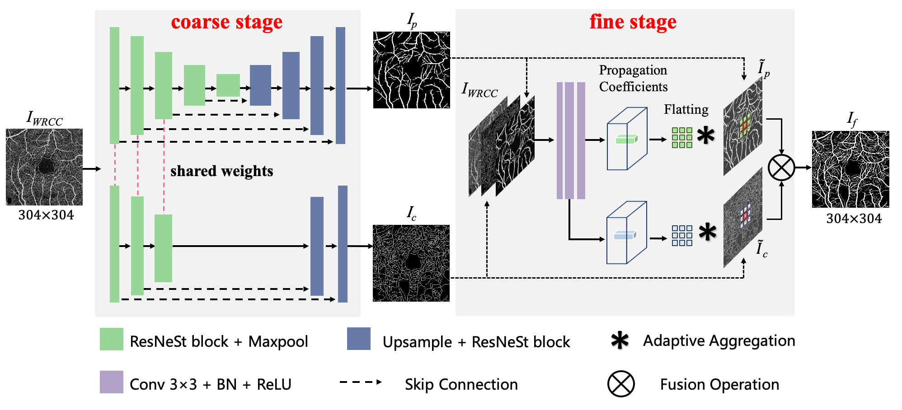
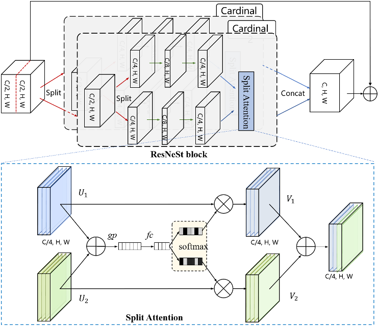

<span id="jump1"></span>
# OCTA-Net: A Two-stage Framework for Vessel Segmentation in OCTA Images



###  [Paper](https://arxiv.org/pdf/2007.05201.pdf) | [BibTex](#jump2)

ROSE: A Retinal OCT-Angiography Vessel Segmentation Dataset and New Model .<br>

[Yuhui Ma](#jump1),  [Huaying Hao](#jump1), [Jianyang Xie](#jump1), [Huazhu Fu](#jump1), [Jiong Zhang](#jump1), [Jianlong Yang](#jump1), [Zhen Wang](#jump1), [Jiang Liu](#jump1), [Yalin Zheng](#jump1) and [Yitian Zhao](#jump1) .<br>

### [License](https://github.com/iMED-Lab/OCTA-Net-OCTA-Vessel-Segmentation-Network/blob/master/LICENSE)

All rights reserved.

The code and data are released for academic research use only. For commercial use, please contact [yitian.zhao@nimte.ac.cn](#jump1).

## Condensed Abstract

Optical Coherence Tomography Angiography (OCTA) is a non-invasive imaging technique that has been increasingly used to image the retinal vasculature at capillary level resolution. However, automated segmentation of retinal vessels in OCTA has been under-studied due to various challenges such as low capillary visibility and high vessel complexity, despite its significance in understanding many vision-related diseases. In addition, there is no publicly available OCTA dataset with manually graded vessels for training and validation of segmentation algorithms. To address these issues, for the first time in the field of retinal image analysis we construct a dedicated Retinal OCTA SEgmentation dataset (ROSE), which consists of 229 OCTA images with vessel annotations at either centerline-level or pixel level. This dataset with the source code has been released for public access to assist researchers in the community in undertaking  research in related topics. Secondly, we introduce a novel split-based coarse-to-fine vessel segmentation network for OCTA images (OCTA-Net), with the ability  to detect thick and thin vessels separately. In the OCTA-Net, a split-based coarse segmentation module is first utilized to produce a preliminary confidence map of vessels, and a split-based refined segmentation module is then used to optimize the shape/contour of the retinal microvasculature. We perform a thorough evaluation of the state-of-the-art vessel segmentation models and our OCTA-Net on the constructed ROSE dataset. The experimental results demonstrate that our OCTA-Net yields better vessel segmentation performance in OCTA than both traditional and other deep learning methods. In addition, we provide a fractal dimension analysis on the segmented microvasculature, and the statistical analysis demonstrates significant differences between the healthy control and Alzheimer's Disease group. This consolidates that the analysis of retinal microvasculature may offer a new scheme to study various neurodegenerative diseases.

## Installation

Clone this repo
```
git clone https://github.com/iMED-Lab/OCTA-Net-OCTA-Vessel-Segmentation-Network.git
```

Prerequisites
* Python3
* numpy
* pillow
* opencv-python
* scikit-learn
* TensorboardX
* Visdom
* PyTorch
* Torchvision

## ROSE:  A Retinal OCT-Angiography Vessel SEgmentation Dataset

The information about the ROSE dataset could be seen in the following link: 
[dataofrose](https://imed.nimte.ac.cn/dataofrose.html)

## Run the code

```
    cd code/OCTA-Net
```
### Start Visdom
```
    python -m visdom.server
```
### Coarse Stage:
```
    python front_main.py
```
### Fine Stage:
```
    python fusion_main.py
```
### Calculate Time Cost:
```
    python test_time.py
```
### Calculate Metrics:
```
    cd ../../evaluation
    python evaluation.py
```
### Calculate Time Cost:
```
    python draw_all_roc.py
```

Note:

train: --mode train

test: --mode test

SCC (ROSE-1): --dataset rose --data_dir ../../data/ROSE-1/SCC

DCC (ROSE-1): --dataset rose --data_dir ../../data/ROSE-1/DCC

WRCC (ROSE-1): --dataset rose --data_dir ../../data/ROSE-1/WRCC

ROSE-2: --dataset cria --data_dir ../../data/ROSE-2


<span id="jump2"></span>
### Citation
If you use this code for your research, please cite our papers.
```
@article{ma2020rose,
  title={ROSE: A Retinal OCT-Angiography Vessel Segmentation Dataset and New Model},
  author={Ma, Yuhui and Hao, Huaying and Xie, Jianyang and Fu, Huazhu and Zhang, Jiong and Yang, Jianlong and Wang, Zhen and Liu, Jiang and Zheng, Yalin and Zhao, Yitian},
  journal={arXiv preprint arXiv:2007.05201},
  year={2020}
}
```

